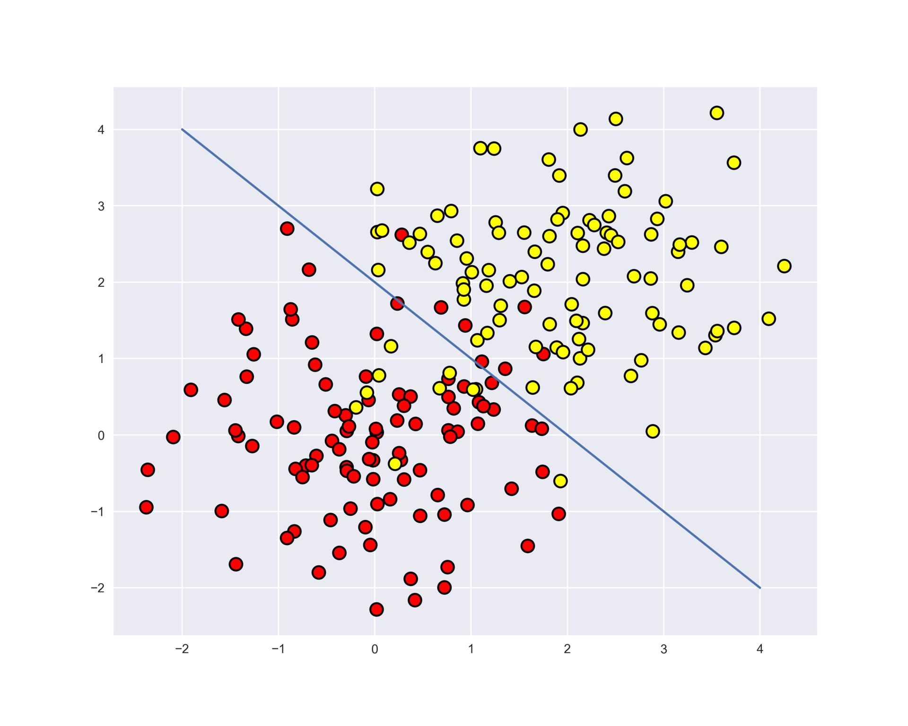

# 16. Общее описание модели бинарной линейной классификации: семейство алгоритмов; геометрическая интерпретация; пороговая функция потерь, ее основной недостаток; верхние оценки пороговой функции. [[⇧]](../questions-list.md)

## Пространство ответов

$$
\mathcal{Y} = \lbrace -1, 1 \rbrace
$$

## Семейство алгоритмов

**Линейный классификатор**:

$$
a(x) = sign \Big( w_0 + ∑_{j=1}^{d} w_jx^j \Big)
$$

$$
sign(z) = \begin{cases} +1, \quad z > 0 \\
0, \quad z = 0 \\
-1, \quad x < 0
\end{cases}
$$

По аналогии с регрессией можно ввести дополнительный константный признак, который на каждом объекте принимает значение, равное $1$, тогда модель может быть записана в компактной форме:

$$a(x) = sign\langle w, x\rangle$$

$\langle w, x \rangle$ – скалярное произведение векторов $w$ и $x$.

## Геометрическая интерпретация

Уравнение $\langle w, x\rangle = 0$ определяет в пространстве признаков **гиперплоскость**, которая разделяет два класса объектов:

- Для всех точек, лежащих по **одну** сторону от гиперплоскости $\langle w, x\rangle > 0$.
- Для всех точек, лежащих по **другую** сторону от гиперплоскости $\langle w, x\rangle < 0$.

Иллюстрация для **двух** признаков:

## Пороговая функция потерь

В качестве меры ошибки можно использовать **пороговую функцию потерь**:

$$
L(y, a) = [a \ne y]
$$

Тогда функционал ошибки — **доля неправильных ответов** для объектов выборки:

$$
Q(a,X) = \frac{1}{n} ∑_{i=1}^{n}[a(x_i) \ne y_i]
$$

Альтернатива — **доля правильных ответов** для объектов выборки:

$$
Q(a,X) = \frac{1}{n} ∑_{i=1}^{n}[a(x_i) = y_i]
$$

### Отступы

**Отступ** — это величина:

$$
M_i = y_i \cdot \langle w, x_i\rangle
$$

- При $M_i > 0$ классификатор дает **правильный** ответ.
- При $M_i < 0$ классификатор **ошибается**.

> Если для некоторого объекта **отступ** имеет отрицательное и большое по модулю значение, то: либо объект является **выбросом**, либо алгоритм не пригоден для решения данной задачи.

Для линейной модели **функционал ошибки** может быть записан через **отступы**:

$$
Q(a,X) = \frac{1}{n}∑_{i=1}^{n}[y_i \cdot \langle w, x_i\rangle < 0] = \frac{1}{n}∑_{i=1}^{n}[M_i < 0]
$$

**Функция потерь** через отступы:

$$
L(M) = [M_i < 0]
$$

Такая функция потерь — **пороговая**, имеет **разрыв** в точке $0$ — применение метода градиентного спуска для обучения модели **невозможно**.

### Верхняя оценка пороговой функции потерь

**Верхняя оценка пороговой функции потерь** — **гладкая** функция, которая оценивает **сверху** пороговую функцию:

$$
[M_i < 0] \le \widetilde{L}(M_i)
$$

$$
 \begin{cases}
\widetilde{L}(M_i) \ge 1, \quad M_i < 0 \\
\widetilde{L}(M_i) \ge 0, \quad M_i > 0
\end{cases}
$$

**Верхняя оценка функционала ошибки** — среднее значение гладкой функции потерь по всей обучающей выборке:

$$
Q(a,X) \le \widetilde{Q}(a,X) = \frac{1}{n}∑_{i=1}^{n}\widetilde{L}(M_i) \to \min_{a}
$$

Используется предположение, что **в точке минимума** верхней оценки доля ошибок будет **минимальна**. Нет гарантий, что при минимизации верхней оценки минимизируется также и $Q(a,X)$, тем не менее:

- При достижении малых значений верхней оценки, будут получены и малые значения для $Q(a,X)$.
- Построена удобна длч решения гладкая задача минимизации.

**Примеры** верхних оценок пороговой функции потерь:

- **Логистическая**: $\widetilde{L}(M_i) = \log(1 + e^{-M_i})$ используется в логистической регрессии.
- **Кусочно‑линейная**: $\widetilde{L}(M_i) = \max(0, 1 -M_i)$ используется в методе опорных векторов.
- **Экспоненциальная**: $\widetilde{L}(M_i) = e^{-M_i}$
- **Сигмоидная**: $\widetilde{L}(M_i) = \frac{2}{1 + e^{M_i}}$
