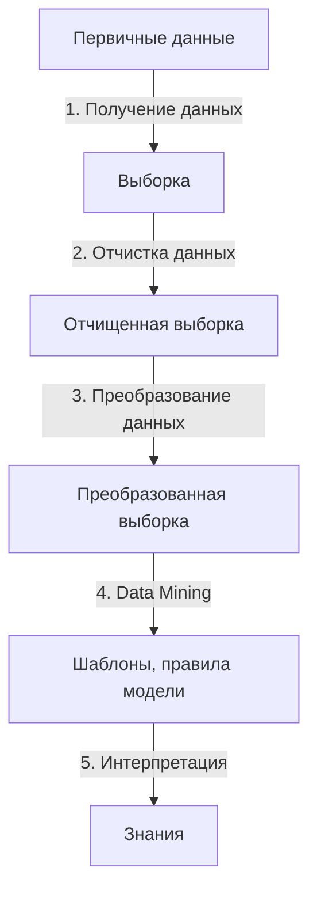

# 6. Технологии бизнес-анализа. Общая схема Knowledge Discovery in Databases, краткая характеристика основных этапов. Data Mining: варианты определений, основные особенности методов. [[⇧]](../questions-list.md)

## Технологии бизнес-анализа

- **Knowledge Discovery in Databases** — обнаружение знаний в базах данных.
- **Data Mining** — интеллектуальный анализ данных.

> В настоящее время на базе этих технологий представлено большинство прикладных аналитических решений.

## Общая схема Knowledge Discovery in Databases, краткая характеристика основных этапов

**Knowledge Discovery in Databases** — описывает не конкретный алгоритм или математический аппарат, а **последовательность** этапов, которые необходимо пройти:

1. **Получение данных**: выдвижение гипотез и отбор признаков, необходимых для анализа.
2. **Очистка данных**: заполнение пропусков, обработка выбросов, сглаживание, исключение дубликатов и противоречий.
3. **Преобразование данных**: приведение типов, выделение временных интервалов, квантование, сортировка, группировка, расчет производных показателей.
4. **Data Mining**: построение модели.
5. **Интерпретация**: методы постобработки, приводящие шаблоны и зависимости к интерпретируемому виду.

## Data Mining: варианты определений, основные особенности методов

**Data Mining** — обнаружение в **сырых** данных ранее **неизвестных**, нетривиальных, практически **полезных** и доступных интерпретации знаний, необходимых для принятия решений в различных сферах человеческой деятельности.

Методы **Data Mining** позволяют получить зависимости нестатического характера:

- Позволяют делать заключения не в среднем по множеству объектов, а для **каждого изучаемого объекта в отдельности**.
- Исследуются объекты, представленные не просто совокупностью элементов, а **имеющие внутреннюю структуру** (набор качественных и количественных отношений между элементами).
