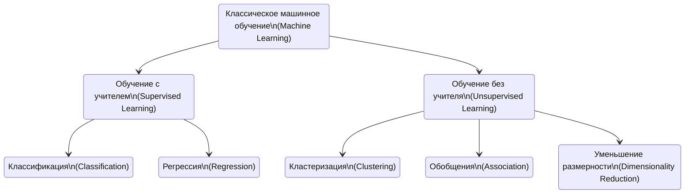

# 7. Понятие о машинном обучении. Общая постановка задачи обучения. Обучение с учителем, без учителя, частичное обучение. Обучение с подкреплением. Применимость методов машинного обучения. [[⇧]](../questions-list.md)

## Понятие о машинном обучении

**Машинное обучение** (`Machine Learning, ML`) — область научного знания, объектом исследования которой являются методы построения алгоритмов, способных **«обучаться»** на данных: конструировать из данных **функцию** (формулу), которая может быть использована для **прогноза** характеристик у объектов.

> В задачах машинного обучения применяются методы: _теории вероятностей_, _математической статистики_, _линейной алгебры_, _оптимизации_. В отличии от традиционных подходов прикладной математики, работа алгоритма машинного обучения не всегда предусматривает объяснение рассматриваемого явления.

## Общая постановка задачи обучения

Зададим **множество объектов** (ситуаций), **множество возможных ответов** (реакций). Между ответами и объектами существует некоторая **зависимость**, но она неизвестна. Требуется обнаружить эту зависимость.

### Методы машинного обучения

#### Обучение с учителем

Известная конечная совокупность пар вида: **объект** и **ответ**, называемая **обучающей выборкой**. На основе этих данных требуется построить модель, которая будет выдавать ответы для **новых** объектов. Для оценки **качества** полученной модели вводится критерий качества на **независимой** (тестовой) выборке.

`Примеры` задач обучения с учителем:

- **Бинарная классификация** – прогноз возврата / невозврата кредита, анализ сообщения спам / не спам.
- **Многоклассовая классификация** – определение тематики статьи, типа транспортного средства по фотографии.
- **Регрессия** – предсказание температуры, покупательского спроса.
- **Ранжирование** – ранжирование страниц поисковой системы по их релевантности.

#### Обучение без учителя

Есть только совокупность объектов, **правильные ответы неизвестны**. Такие методы как правило, труднее интерпретировать и оценивать.

`Примеры` задач обучения без учителя:

- **Кластеризация** – задача разделения множества объектов на группы, обладающие определенными свойствами: сегментация пользователей, определение тем в наборе постов.
- **Задача визуализации** – получение изображения многомерной выборки в двумерном или трехмерном пространстве таким образом, чтобы сохранялось как можно больше отношений и зависимостей между ними.
- **Понижения размерности** – задача генерации таких новых признаков, что их количество меньше, чем исходных признаков, но при этом качество решения задачи на основе сегментированных признаков не хуже или потери качества незначительны.
- **Оценивание плотности распределения** – задача приближения распределения признаков: задача обнаружения аномалий, в отличие от бинарной классификации примеров аномальных объектов нет вообще, либо очень мало (недостаточно для обучения с учителем).

#### Частичное обучение

Задача, в которой для **некоторой части** объектов обучающей выборки известны и значения признаков, и ответы, для остальных только значения признаков.

#### Активное обучение

Получение правильных ответов для объектов может быть связанно с затратами, алгоритм должен определить, на каких объектах необходимо получить ответы, чтобы лучше всего обучиться.

#### Обучение с подкреплением

Модель не имеет информации о системе, но **может воздействовать** на систему, переводя ее в новое состояние. Обучение модели за счёт взаимодействия с системой: модель получает от системы положительные или отрицательные **подкрепления**.

## Применимость методов машинного обучения

Машинное обучение **не следует** применять везде, где требуется построить зависимость одной переменной от набора других.

> Вначале необходимо проанализировать исходную задачу на наличие **детерминированного** алгоритма решения.

Машинное обучение **следует** применять если:

- **Нельзя** вывести корректную формулу будущей зависимости из каких-либо знаний об устройстве мира.
- Прогнозируемая величина зависит от **входных** признаков, но при этом вид зависимости достаточно сложный, и подобрать его вручную может быть слишком трудно.
- Можно набрать **достаточное** количество примеров, по которым можно оценивать зависимость прогнозируемой величины от входных признаков.
- Зависимость ответа от признаков вполне понятна, но само **построение** ответа достаточно трудоемко.
- Алгоритм решения некоторых задач **невозможно** записать, при этом люди **успешно** справляются с этими задачами при наличии опыта.
