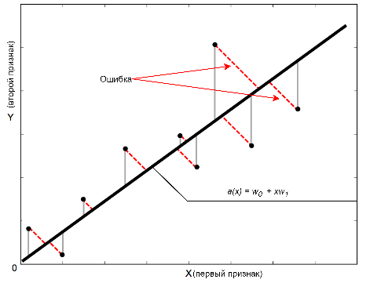
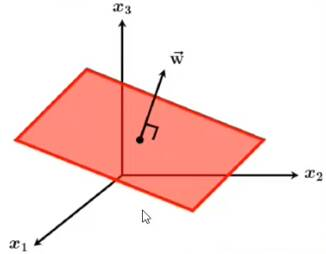

# 9. Общее описание модели линейной регрессии: семейство алгоритмов, его геометрическая интерпретация; функционалы ошибки, обучение модели (в развернутой и в матричной форме). [[⇧]](../questions-list.md)

## Пространство ответов

$$
\mathcal{Y} = \mathbb{R}
$$

## Семейство алгоритмов

$$
a(x) = w_0 + w_1 \cdot x^1 + \ldots + w_d \cdot x^d
$$

$$
a(x) =w_0 + ∑_{j=1}^{d} w_j \cdot x^j
$$

$w_0$ – свободный коэффициент (сдвиг).

$d$ – количество признаков.

$x^j$ – признаки.

$w_j$ – коэффициенты (веса) признаков.

Для получения однородной модели вводят фиктивный константный признак (с номером $d+1$), который на каждом объекте принимает значение, равное $1$. Тогда модель может быть записана в более компактной форме:

$$a(x) = ∑_{j=1}^{d+1} w_j \cdot x^j =\langle w, x\rangle$$

$\langle w, x \rangle$ – скалярное произведение векторов $w$ и $x$.

## Геометрическая интерпретация

### Простейший случай, один признак

Если предположить что зависимость приблизительно линейная, то графически ее можно представить в виде **прямой**. По уравнению этой прямой можно предсказать значение целевого признака:

$w_0$ – ордината точки пересечения прямой с осью ординат.

$w_1$ – тангенс наклона прямой.

> В целом такая модель может предсказывать значение признаков, но не идеально, а с некоторой ошибкой.

### Общий случай много признаков

Построение линейной регрессии — попытка провести **гиперплоскость** через все точки (объекты), модель определяется вектором весов $w$ (весом нормали).

$w$ – вектор нормали к гиперплоскости, $x$ – вектор объекта,  
$\langle w, x \rangle$ – проекция вектора $x$ на нормаль.

## Функционалы ошибки

В качестве меры ошибки можно использовать **модуль** отклонения:

$$
|a(x)-y|
$$

> Модуль используется, так как мера ошибки должна иметь значения большие $0$, в противном случае минимум функционала ошибки не будет достигаться при правильном ответе.

Однако чаще всего используется **квадрат** отклонения:

$$
(a(x) - y)^2
$$

> В случае квадрата отклонения, функционал ошибки — выпуклая и гладкая функция, значит можно применять градиентные методы оптимизации.

Тогда **функционал ошибки** называется **среднеквадратичной** ошибкой алгоритма — **MSE**:

$$
Q(a,X) = \frac{1}{n} ∑_{i=1}^{n}(a(x_i) - y_i)^2
$$

$n$ – объем обучающей выборки.

Для линейной модели функционал можно записать в виде функции:

$$
Q(a,X) = \frac{1}{n}∑_{i=1}^{n}(\langle w, x_i \rangle - y_i)^2
$$

$\langle w, x_i \rangle$ – скалярное произведение вектора весов $w$ и вектора признаков $i$-го объекта.

## Задача обучения модели

**Выборка** представляется матрицей «объекты–признаки»:

$$
X = \begin{pmatrix}
       x_{11} & x_{12} & \ldots & x_{1d} \\
       x_{21} & x_{22} & \ldots & x_{2d} \\
       \ldots & \ldots & \ldots & \ldots \\
       x_{n1} & x_{n2} & \ldots & x_{nd}
   \end{pmatrix}\in \mathbb{R}^{n \times d}
$$

$n$ – количество объектов.

$d$ – количество признаков.

$x_{ij}$ – значение $j$-го признака на $i$-том объекте.

> Строки — признаковое описание объекта, столбцы — значения определенного признака на всех объектах.

**Вектор весов**:

$$
w = \begin{pmatrix}
w_1 \\
w_2 \\
\ldots\\
w_d \end{pmatrix}\in \mathbb{R}^{d \times 1}
$$

$w_j$ – вес $j$-го признака.

**Вектор ответов**:

$$
y = \begin{pmatrix}
y_1 \\
y_2 \\
\ldots \\
y_n \end{pmatrix}\in \mathbb{R}^{n \times 1}
$$

$y_i$ – значение истинного ответа на $i$-том объекте.

**Результат** применения линейной модели к выборке $X$:

$$
X \cdot w = \begin{pmatrix}
      x_{11} & x_{12} & \ldots & x_{1d} \\
      x_{21} & x_{22} & \ldots & x_{2d} \\
      \ldots & \ldots & \ldots & \ldots \\
      x_{n1} & x_{n2} & \ldots & x_{nd}
   \end{pmatrix} \cdot \begin{pmatrix}
   w_1 \\
   w_2 \\
   \ldots \\
   w_d \end{pmatrix} =
$$

$$
= \begin{pmatrix}
∑_{i=1}^{d}w_{i}x_{1i} \\
∑_{i=1}^{d}w_{i}x_{2i} \\
\ldots \\
∑_{i=1}^{d}w_{i}x_{ni} \end{pmatrix} = \begin{pmatrix}
\langle w, x_1 \rangle \\
\langle w, x_2 \rangle \\
\ldots \\
\langle w, x_n \rangle \end{pmatrix}
$$

**Отклонения** прогнозов от ответов:

$$
X \cdot w - y =  \begin{pmatrix}
\langle w, x_1 \rangle - y_1 \\
\langle w, x_2 \rangle - y_2 \\
\ldots \\
\langle w, x_n \rangle - y_n \end{pmatrix}
$$

**Функция ошибки** может быть записана с помощью нормы вектора:

$$Q(w,X) = \frac{1}{n} || X \cdot w-y ||^2 \to \min_{w}$$

Евклидова **норма вектора**:

$$||z||=\sqrt{∑_{j=1}^{n}z_j^2} \quad \quad ||z||^2= ∑_{j=1}^{n}z_j^2$$

**Задача обучения** — требуется найти $d$ неизвестных весов (включая вес введенного ранее константного признака):
$$Q(w,X) \to \min_{w}$$
